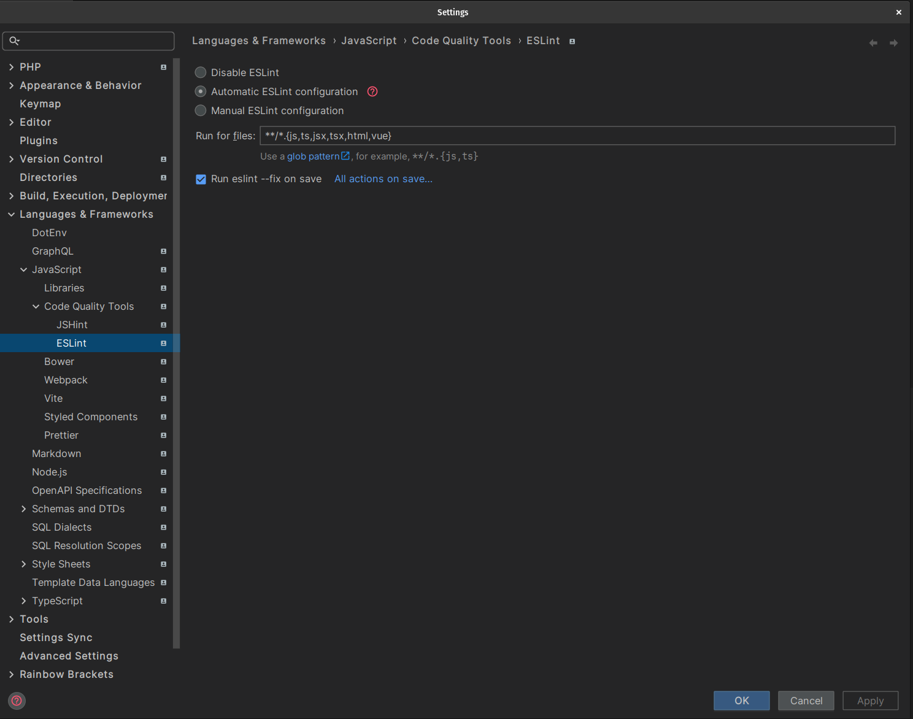
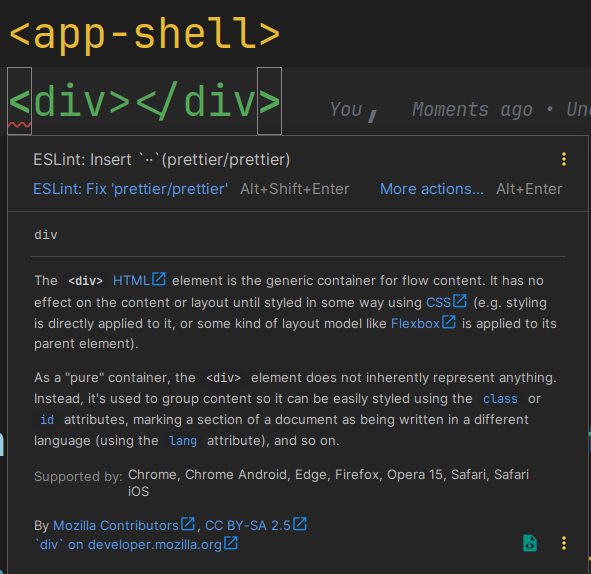

# Exercise: angular setup

This exercise should be seen as an introduction session into the `@angular/cli`.
You will learn all the basic commands you need to know in order make your live as a developer easier
when maintaining an angular project.

## 0. Make sure you have correct `node` * `npm` version

* `node ^18.19.1 || ^20.11.1 || ^22.0.0`
* `npm > 8`

e.g. 
```bash
node -v
v20.11.1

npm -v 
10.2.4

```

## 1. OPTIONAL: Install global cli

> [!NOTE]
> If you don't do this exercise, you can always use `npx` instead.
> `npx ng ...`.

First of all, check if you already have a version installed

```bash
ng version
```

Check if the version matches the current latest version `18.x.x`.

If so, you can skip the installation.

```bash
# if already installed with a lower version

npm i @angular/cli@latest -g
```

Output
```bash
+ @angular/cli@18.x.x
added 1 package from 1 contributor and updated 2 packages in ...
```

## 2. Open Project in IDE

> [!NOTE]
> If you use `vscode` you can run it directly from the terminal by executing `code ./path-to-project`.

```bash
code ./ng-basic-ws
```

## 3. serve application

```bash
ng serve

# or

npx ng serve
```

application will be served at `localhost:4200` as default

> [!TIP]
> you can let the cli open your browser on the served host:port pattern with the `-o` argument

```bash
ng serve -o

# or

npx ng serve -o
```

## 4. Make sure the IDE, eslint & prettier are set up correctly

### 4.1 VSCode

```bash
CTRL + P

ext install esbenp.prettier-vscode

ext install dbaeumer.vscode-eslint

```
// .vscode/settings.json

```json

{
  "editor.formatOnSave": true,
  "editor.codeActionsOnSave": {
    "source.fixAll.eslint": true
  },
  "eslint.format.enable": true,
}
```

### 4.2 WebStorm


Open the settings and search for `eslint`, set it up like shown in the following image:



Open the settings and search for `prettier`, set it up like shown in the following image:


### 4.3 Test the setup

Open the `src/app/app.component.ts` file and change the template to an invalid format according to our 
linting rules, e.g. adding an unused import `import { Observable } from 'rxjs'`.

See if your IDE notifies you about any eslint issue and if saving the file fixes it automatically.




## 5. build

create a production build of the application

```bash
ng build

#or

npx ng build
```

inspect the output in the `dist/` folder, your app should have been generated there

## 6. OPTIONAL: caching

You should notice that a directory `.angular/cache` was created.  
Please stop any running process before continuing.

Run `ng build`, you should notice it runs quite fast.

Now remove the `.angular/.cache` folder completely and rebuild the application
with `ng build`.

The process should be much slower compared to the run before.

